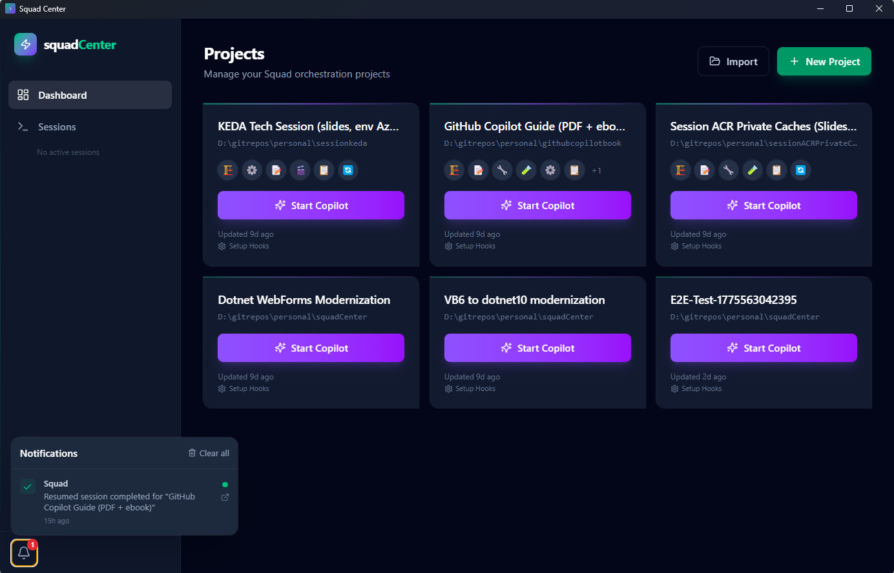

# 🎯 Squad Center

**Desktop command center for orchestrating GitHub Copilot CLI sessions with Squad agent teams.**

[](https://www.electronjs.org/)
[](https://react.dev/)
[](https://www.typescriptlang.org/)
[](https://tailwindcss.com/)

---

## 📖 What is Squad Center?

Squad Center is an Electron desktop application that lets you manage multiple software projects, launch GitHub Copilot CLI sessions, and monitor your Squad agent teams — all from a single interface.

Think of it as a mission control dashboard: you configure projects, spin up Copilot or shell sessions with integrated terminals, track agent activity in real time via Copilot hooks, and get notified when agents finish their work.

## ✨ Features

- 📁 **Project Management** — Create, import from folders, configure, and archive projects with `.squad/` team detection
- 🚀 **Session Launcher** — Start Copilot CLI or shell sessions per project with one click
- 🖥️ **Integrated Terminal** — Full interactive terminal powered by xterm.js and node-pty
- 👥 **Squad Visualization** — See your agent team roster with live status indicators
- 🔔 **Real-time Notifications** — Get alerts when agents complete tasks or encounter errors
- 🔄 **Copilot Hooks** — Live activity timeline tracking prompts, tool usage, and session events
- 📊 **Session Stats** — Token usage, premium request counts, and per-session metrics
- ⚙️ **Configurable** — Shell selection, terminal fonts (NerdFonts), environment variables, pre-launch commands, Copilot CLI args
- 🔌 **MCP Servers** — View configured MCP servers per project
- ☁️ **Azure Account** — Display active Azure account context in session sidebar

## 📸 Screenshots

### Dashboard

*Project overview with Squad agent team avatars, session launcher, and real-time monitoring status.*

## 🛠️ Tech Stack

| Layer | Technology |
|-------|-----------|
| **Language** | TypeScript 5.8 |
| **Framework** | React 19 |
| **Build Tool** | Vite 6 |
| **Styling** | TailwindCSS v4 |
| **Desktop** | Electron 35 |
| **Terminal** | xterm.js 6 + node-pty |
| **Routing** | React Router v7 (HashRouter) |
| **Icons** | Lucide React |
| **Testing** | Playwright (E2E) |

## 🚀 Getting Started

### Prerequisites

- **Node.js** 22+ and npm
- **GitHub Copilot CLI** installed and authenticated
- **Squad agent** configuration (optional — for team features)

### Install

Choose your preferred installation method:

#### 📦 npm (all platforms)
```bash
npm install -g squad-center
squad-center
```

#### 🍫 Chocolatey (Windows)
```powershell
choco install squad-center
```

#### 🪟 winget (Windows)
```powershell
winget install jmanuelcorral.SquadCenter
```

#### 🐧 apt (Debian/Ubuntu)
```bash
# Add the GPG key
curl -fsSL https://jmanuelcorral.github.io/squadcenter/gpg-key.public \
  | sudo gpg --dearmor -o /usr/share/keyrings/squad-center.gpg

# Add the repository
echo "deb [signed-by=/usr/share/keyrings/squad-center.gpg] https://jmanuelcorral.github.io/squadcenter/apt stable main" \
  | sudo tee /etc/apt/sources.list.d/squad-center.list

# Install
sudo apt update && sudo apt install squad-center
```

#### 📥 Direct download
Grab the latest installer from [GitHub Releases](https://github.com/jmanuelcorral/squadcenter/releases):
- **Windows:** `Squad-Center-Setup-x.y.z.exe`
- **macOS:** `Squad-Center-x.y.z-arm64.dmg`
- **Linux:** `Squad-Center-x.y.z.AppImage` or `squad-center_x.y.z_amd64.deb`

### Development Setup

```bash
# Clone the repository
git clone https://github.com/jmanuelcorral/squadcenter.git
cd squadCenter

# Install dependencies (includes native module compilation for node-pty)
npm install

# Start in development mode
npm run dev
```

The Electron app will launch with hot-reload enabled for both the renderer (React) and main process.

## 📜 Scripts

| Script | Description |
|--------|-------------|
| `npm run dev` | Start Electron app in development mode with hot-reload |
| `npm run build` | Build the renderer (Vite) and main process for production |
| `npm run preview` | Preview the production build |
| `npm test` | Run the full Playwright E2E test suite |
| `npm run test:prereqs` | Run only the prerequisites check tests |
| `npm run test:e2e` | Build then run the full E2E suite |

## 📂 Project Structure

```
squadCenter/
├── electron/              # Electron main process
│   ├── main.ts            # App entry point, window creation
│   ├── preload.ts         # IPC bridge (contextBridge)
│   ├── hooks-server.ts    # HTTP server for Copilot hook callbacks
│   ├── ipc/               # IPC handler modules
│   │   ├── projects.ts    # Project CRUD operations
│   │   ├── sessions.ts    # Session lifecycle management
│   │   ├── filesystem.ts  # Folder browsing for import
│   │   ├── notifications.ts
│   │   └── hooks.ts       # Hook event queries
│   └── services/          # Core backend services
│       ├── session-manager.ts    # PTY process management
│       ├── storage.ts            # JSON file persistence
│       ├── squad-reader.ts       # .squad/ directory parser
│       ├── hook-manager.ts       # Copilot hooks lifecycle
│       ├── hooks-generator.ts    # Hook script generation
│       ├── hook-event-store.ts   # Hook event storage
│       ├── event-bridge.ts       # IPC event broadcasting
│       └── environment-info.ts   # System context (Azure, MCP)
├── src/                   # React renderer process
│   ├── main.tsx           # React entry point
│   ├── App.tsx            # HashRouter, routes, providers
│   ├── index.css          # Tailwind v4 + custom animations
│   ├── pages/
│   │   ├── Dashboard.tsx       # Project grid, modals
│   │   ├── ProjectView.tsx     # Project detail (3-column)
│   │   └── SessionView.tsx     # Terminal + sidebar panels
│   ├── components/
│   │   ├── Layout.tsx          # App shell with sidebar
│   │   ├── Sidebar.tsx         # Navigation + session count
│   │   ├── SessionTerminal.tsx # xterm.js terminal (PTY/message modes)
│   │   ├── ActivityTimeline.tsx # Hook event stream
│   │   ├── ProjectCard.tsx     # Dashboard project card
│   │   ├── TeamPanel.tsx       # Agent team roster
│   │   └── ...                 # Modals, panels, inputs
│   ├── hooks/
│   │   ├── useIpcEvents.ts     # Electron IPC event subscriptions
│   │   └── useNotifications.tsx # Notification context provider
│   ├── lib/
│   │   └── api.ts              # IPC invoke wrappers (23 channels)
│   └── types/
│       └── electron.d.ts       # Window.electronAPI declarations
├── shared/
│   └── types.ts           # Shared TypeScript interfaces
├── e2e/                   # Playwright E2E tests (7 spec files, 46 tests)
├── index.html             # Vite entry HTML
├── vite.config.ts         # Vite + Electron plugin config
├── tsconfig.json          # TypeScript config
└── playwright.config.ts   # E2E test configuration
```

## ⚙️ Configuration

Each project in Squad Center can be individually configured:

```typescript
interface CopilotConfig {
  args: string[];              // Extra Copilot CLI arguments
  envVars: Record<string, string>; // Environment variables for sessions
  preCommands: string[];       // Commands to run before session start
  startCopilot?: boolean;      // Auto-start Copilot on project open
  shell?: string;              // Shell executable (e.g., powershell, bash)
  terminalFontFamily?: string; // Terminal font (NerdFont support)
  terminalFontSize?: number;   // Terminal font size
}
```

Configuration is set per-project through the **Project Config** modal in the UI.

## 🧪 Testing

Squad Center uses **Playwright** for end-to-end testing against the built Electron application.

```bash
# Run all tests
npm test

# Run with build step
npm run test:e2e

# Run a specific test file
npx playwright test e2e/03-dashboard.spec.ts
```

**Test coverage** — 7 spec files covering:

| File | Scope |
|------|-------|
| `01-prerequisites.spec.ts` | Environment and dependency checks |
| `02-app-launch.spec.ts` | Electron window creation and loading |
| `03-dashboard.spec.ts` | Dashboard rendering and interactions |
| `04-project-management.spec.ts` | Project CRUD operations |
| `05-project-config.spec.ts` | Configuration modal and persistence |
| `06-navigation.spec.ts` | Routing and navigation flows |
| `07-ipc-communication.spec.ts` | IPC channel communication |
| `08-notifications-hooks.spec.ts` | Notifications pipeline & hooks |

## 🏗️ Building

The app is built using Vite with the `vite-plugin-electron` plugin, which handles both the renderer (React) and main process (Electron) compilation.

```bash
# Production build (renderer + main process)
npm run build
```

The build outputs to:
- `dist/` — Renderer bundle (React app)
- `dist-electron/` — Main process bundle (`main.js`, `preload.js`)

## 🤝 Contributing

Squad Center is built using a **Squad agent team** workflow. The team configuration lives in `.squad/` and includes:

- **Neo** — Lead architect and coordinator
- **Morpheus** — Backend developer (Electron main process, IPC, services)
- **Trinity** — Frontend developer (React, UI components, UX)
- **Tank** — DevOps engineer (CI/CD, packaging, release pipelines)

Architectural decisions are documented in `.squad/decisions.md`.

## 📄 License

MIT — see [LICENSE](LICENSE) for details.
